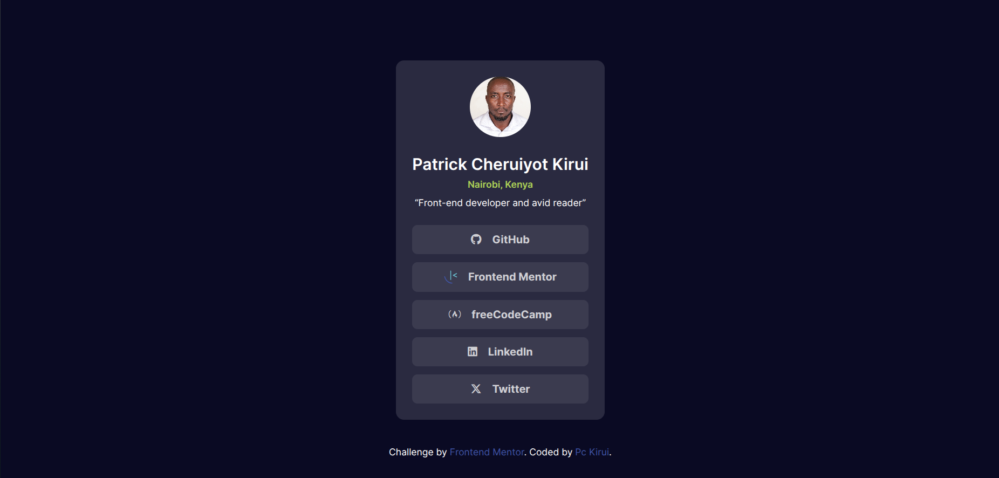

# Frontend Mentor - Social links profile solution

This is a solution to the [Social links profile challenge on Frontend Mentor](https://www.frontendmentor.io/challenges/social-links-profile-UG32l9m6dQ). Frontend Mentor challenges help you improve your coding skills by building realistic projects.

## Table of contents

- [Overview](#overview)
  - [The challenge](#the-challenge)
  - [Screenshot](#screenshot)
  - [Links](#links)
- [My process](#my-process)
  - [Built with](#built-with)
  - [What I learned](#what-i-learned)
  - [Continued development](#continued-development)
- [Author](#author)

## Overview

### The challenge

This was a small project that entailed designing a social links profile or a digital business card. The end result was to get something close to the design as seen from the preview obove.

### Screenshot

I completed the project. The screeshot of the output, as seen from the desktop is given above.

### Links

- Solution URL: [Solution](https://github.com/Pc-Kirui/socialLinksSharingProfile)
- Live Site URL: [Live Preview](https://pc-kirui.github.io/socialLinksSharingProfile/)

## My process

### Built with

- Semantic HTML5 markup
- CSS custom properties
- Flexbox
- Mobile-first workflow

### What I learned

The key takeaways from the project are:

- Responsiveness: Using max-width property, media queries and relative units to ensure the output was reponsive across a wide range of devices.

- Fontawesome Icons: Was able to learn how to include Icons to my project using Font Awesome Kits. Also handled custom brand icons, like Frontend Mentor logo, which aren't included in the standard library, by using SVGs.

- Accessibility and semantics: Through the use of aria labels and unordered list.Also learned the use of rel="noopener noreferrer" attribute in HTML, which enhances security by preventing the new tab from knowing the origin of the traffic and manipulating the original tab.

- Improved my understanding on CSS custom properties.

### Continued development

- CSS Custom Properties
- Media Queries

## Author

- Website - [Patrick Kirui](https://pc-kirui.github.io/)
- Frontend Mentor - [@Pc-Kirui](https://www.frontendmentor.io/profile/Pc-Kirui)
- Twitter - [@PcKirui](https://x.com/PcKirui)
